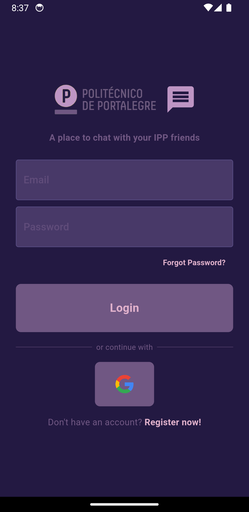
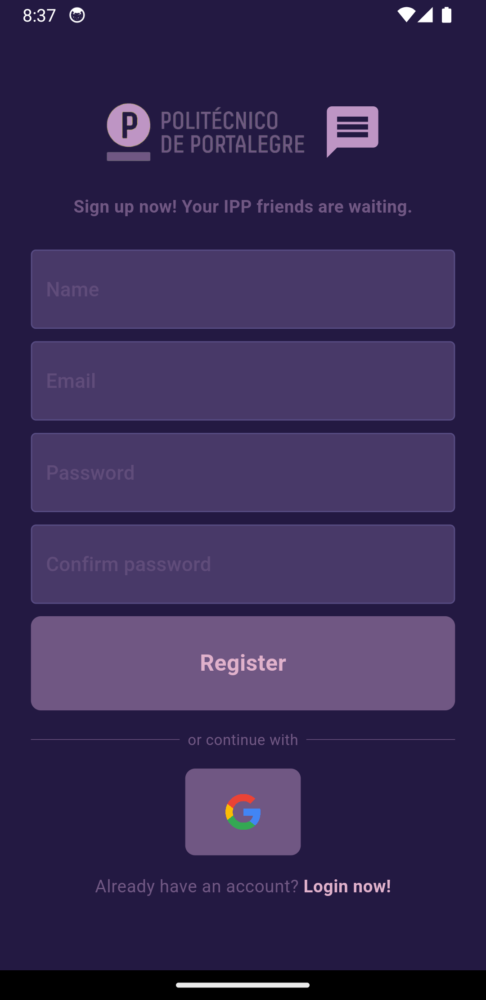
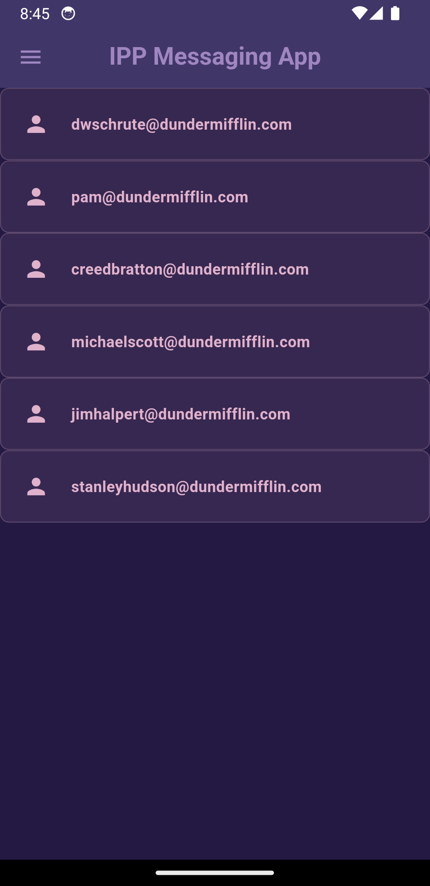
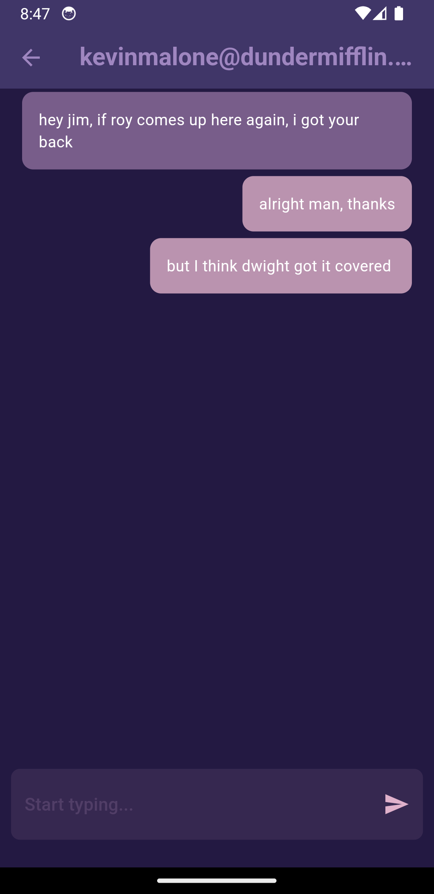
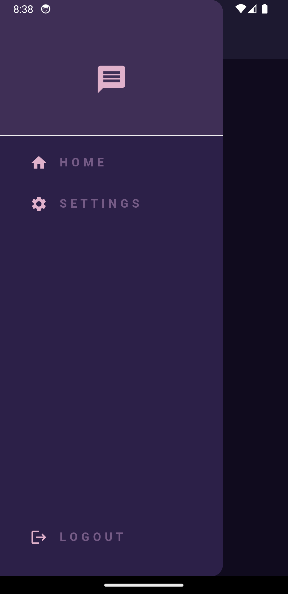
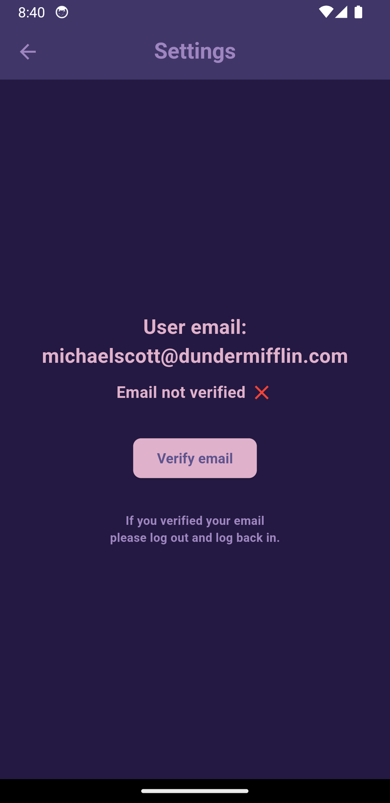
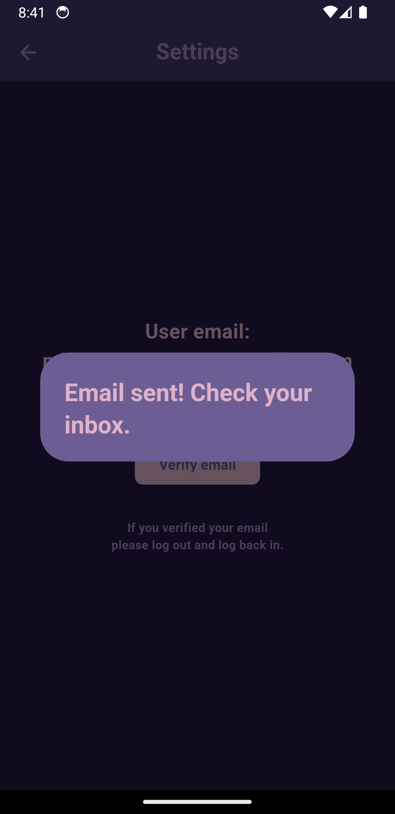

# ipp_messaging_app

A messaging app using Flutter and Firebase.

## Description

This project was assigned to me as a Mobile Computing final project at the Instituto Politécnico de Portalegre (IPP). 

It includes user authentication, Google sign-in, and a list of registered users to talk to. It stores data in the Cloud Firestore. 

The color palette used in this application can be found [here](https://coolors.co/palette/231942-5e548e-9f86c0-be95c4-e0b1cb).

## Screenshots

<table>
  <tr>
    <td></td>
    <td></td>
  </tr>
  <tr>
    <td></td>
    <td></td>
  </tr>
  <tr>
    <td></td>
    <td></td>
  </tr>
  <tr>
    <td></td>
  </tr>
</table>
